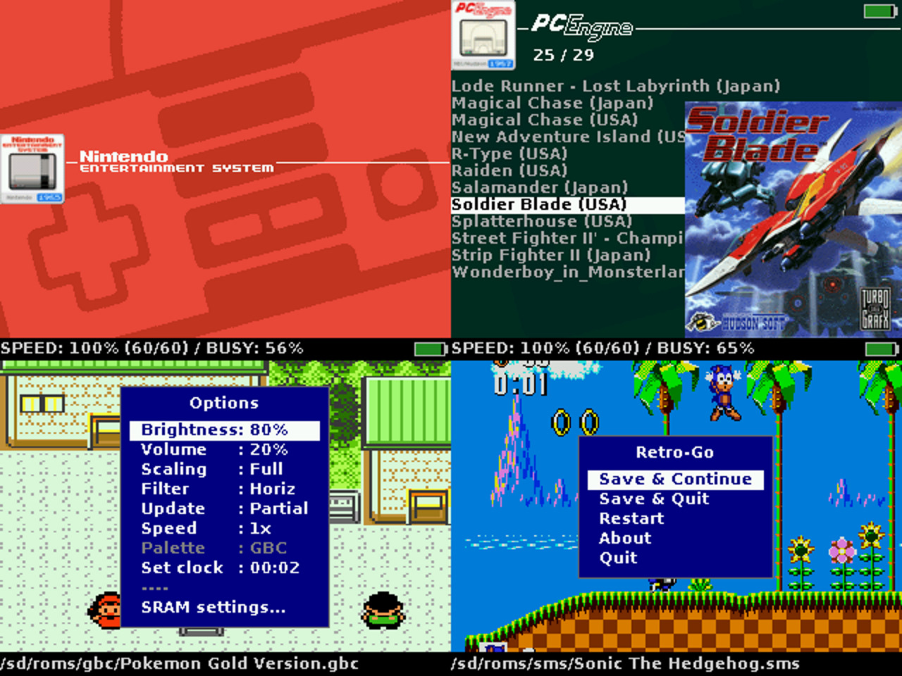

# Table of contents
- [Description](#description)
- [Installation](#installation)
- [Usage](#usage)
- [Issues](#issues)
- [Development](#development)
- [Acknowledgements](#acknowledgements)
- [License](#license)

# Description
Retro-Go is a firmware to play retro games on ESP32-based devices (officially supported are
ODROID-GO and MRGC-G32, check [this list for other devices](components/retro-go/README.md)).
The project consists of a launcher and half a dozen applications that have been heavily
optimized to reduce their cpu, memory, and flash needs without reducing compatibility!

### Supported systems:
- Nintendo: **NES, SNES (slow), Gameboy, Gameboy Color, Game & Watch**
- Sega: **SG-1000, Master System, Mega Drive / Genesis, Game Gear**
- Coleco: **Colecovision**
- NEC: **PC Engine**
- Atari: **Lynx**
- Others: **DOOM** (including mods!)

### Retro-Go features:
- In-game menu
- Favorites and recently played
- GB color palettes, RTC adjust and save
- NES color palettes, PAL roms, NSF support
- More emulators and applications
- Scaling and filtering options
- Better performance and compatibility
- Turbo Speed/Fast forward
- Customizable launcher
- Cover art and save state previews
- Multiple save slots per game
- Wifi file manager
- And more!

### Screenshots



# Installation

### ODROID-GO
  1. Download `retro-go_1.x_odroid-go.fw` from the [release page](https://github.com/ducalex/retro-go/releases/) and copy it to `/odroid/firmware` on your sdcard.
  2. Power up the device while holding down B.
  3. Select retro-go in the files list and flash it.

### MyRetroGameCase G32 (GBC)
  1. Download `retro-go_1.x_mrgc-g32.fw` from the [release page](https://github.com/ducalex/retro-go/releases/) and copy it to `/espgbc/firmware` on your sdcard.
  2. Power up the device while holding down MENU (the volume knob).
  3. Select retro-go in the files list and flash it.

### Generic ESP32
This method is intended to be used when .fw support isn't available (when [porting to a new device](PORTING.md)) or undesirable (devices with smaller flash).
  1. Build a .img file (refer to [Building Retro-Go](BUILDING.md))
  2. Flash the image: `esptool.py write_flash --flash_size detect 0x0 retro-go_*.img`
      _Note: Your particular device may require extra steps (like holding a button during power up), different esptool flags, or modifying base.sdkconfig._


# Usage

## Game covers / artwork
Game covers should be placed in the `romart` folder at the base of your sd card. You can obtain a pre-made pack [here](https://github.com/ducalex/retro-go-covers). Retro-Go is also compatible with the older Go-Play romart pack.

You can add missing cover art by creating a PNG image (160x168, 8bit). Two naming schemes are supported:
- Filename-based: `/romart/nes/Super Mario.png` (notice the rom extension is *not* included)
- CRC32-based: `/romart/nes/A/ABCDE123.png` where `nes` is the same as the rom folder, and `ABCDE123` is the CRC32 of the game (press A -> Properties in the launcher to find it), and `A` is the first character of the CRC32

_Note: CRC32-based, which is what is used in the pre-made pack, is much slower than name-based! This type is useful because filenames vary greatly despite having identical CRCs, but if you generate your own art I suggest you use filename-based format and delete all CRC-based art from your SD Card to improve responsiveness._


## BIOS files
Some emulators support loading a BIOS. The files should be placed as follows:
- GB: `/retro-go/bios/gb_bios.bin`
- GBC: `/retro-go/bios/gbc_bios.bin`
- FDS: `/retro-go/bios/fds_bios.bin`
- MSX: In folder `/retro-go/bios/msx/` put: `MSX.ROM` `MSX2.ROM` `MSX2EXT.ROM` `MSX2P.ROM` `MSX2PEXT.ROM` `FMPAC.ROM` `DISK.ROM` `MSXDOS2.ROM` `PAINTER.ROM` `KANJI.ROM`


## Game & Watch
The roms must be packed with [LCD-Game-Shrinker](https://github.com/bzhxx/LCD-Game-Shrinker) and a tutorial can be [found here](https://gist.github.com/DNA64/16fed499d6bd4664b78b4c0a9638e4ef).


## Wifi
To use wifi you will need to create a `/retro-go/config/wifi.json` config file. You can define up to 4 different networks, then selectable in the menu. Its content should look like this:

````json
{
  "ssid0": "my-network",
  "password0": "my-password",
  "ssid1": "my-other-network",
  "password1": "my-password",
  "ssid2": "my-third-network",
  "password2": "my-password",
  "ssid3": "my-last-network",
  "password3": "my-password"
}
````

### Time synchronization
Time synchronization happens in the launcher immediately after a successful connection to the network.
This is done via NTP by contacting `pool.ntp.org` and cannot be disabled at this time.
Timezone can be configured in the launcher's options menu.

### File manager
You can find the IP of your device in the *about* menu of retro-go. Then on your PC navigate to
http://192.168.x.x/ to access the file manager.


## External DAC (headphones)

Retro-Go supports [the external DAC mod for the ODROID-GO](https://github.com/backofficeshow/odroid-go-audio-hat)
which allows high quality audio through headphones. You can switch to it in the menu `Audio Out: Ext DAC`.

<details>
  <summary>Pinout</summary>

  | GO PIN | PCM5102A PIN |
  |--------|---------|
  | 1 | GND |
  | 2 | - |
  | 3 | LCK |
  | 4 | DIN |
  | 5 | BCK |
  | 6 | VIN |
  | 7 | - |
  | 8 | - |
  | 9 | - |
  | 10 | - |
</details>


# Issues

### Black screen / Boot loops
Retro-Go typically detects and resolves application crashes and freezes automatically. However, if you do
get stuck in a boot loop, you can hold `DOWN` while powering up the device to return to the launcher.

### Sound quality
The volume isn't correctly attenuated on the GO, resulting in upper volume levels that are too loud and
lower levels that are distorted due to DAC resolution. A quick way to improve the audio is to cut one
of the speaker wire and add a `33 Ohm (or thereabout)` resistor in series. Soldering is better but not
required, twisting the wires tightly will work just fine.
[A more involved solution can be seen here.](https://wiki.odroid.com/odroid_go/silent_volume)
Alternatively you can use the headphones DAC mod mentioned earlier in this document.

### Game Boy SRAM *(aka Save/Battery/Backup RAM)*
In Retro-Go, save states will provide you with the best and most reliable save experience. That being said, please
read on if you need or want SRAM saves. The SRAM format is compatible with VisualBoyAdvance so it may be used to
import or export saves.

You can configure automatic SRAM saving in the options menu. A longer delay will reduce stuttering at the cost
of losing data when powering down too quickly. Also note that when *resuming* a game, Retro-Go will give priority
to a save state if present.

### ZIP files
Most Retro-Go applications now support ZIP files. ZIP archives should contain only one ROM file and nothing else. ZIP support also depends on available memory and larger ROMs may fail to load on some devices unfortunately.


# Development
If you wish to build or modify Retro-Go, you can find help in the following documents:

- Build instructions in [BUILDING.md](BUILDING.md)
- Theming instructions [THEMING.md](THEMING.md)
- Porting instructions in [PORTING.md](PORTING.md)
- Translating instructions in [LOCALIZATION.md](LOCALIZATION.md)


# Acknowledgements
- The NES/GBC/SMS emulators and base library were originally from the "Triforce" fork of the [official Go-Play firmware](https://github.com/othercrashoverride/go-play) by crashoverride, Nemo1984, and many others.
- The design of the launcher was originally inspired/copied from [pelle7's go-emu](https://github.com/pelle7/odroid-go-emu-launcher).
- PCE-GO is a fork of [HuExpress](https://github.com/kallisti5/huexpress) and [pelle7's port](https://github.com/pelle7/odroid-go-pcengine-huexpress/) was used as reference.
- The Lynx emulator is a port of [libretro-handy](https://github.com/libretro/libretro-handy).
- The SNES emulator is a port of [Snes9x 2005](https://github.com/libretro/snes9x2005).
- The DOOM engine is a port of [PrBoom 2.5.0](http://prboom.sourceforge.net/).
- The Genesis emulator is a port of [Gwenesis](https://github.com/bzhxx/gwenesis/) by bzhxx.
- The Game & Watch emulator is a port of [lcd-game-emulator](https://github.com/bzhxx/lcd-game-emulator) by bzhxx.
- The MSX emulator is a port of [fMSX](https://fms.komkon.org/fMSX/) by Marat Fayzullin.
- PNG support is provided by [lodepng](https://github.com/lvandeve/lodepng/).
- PCE cover art is from [Christian_Haitian](https://github.com/christianhaitian).
- Some icons from [Rokey](https://iconarchive.com/show/seed-icons-by-rokey.html).
- Background images from [es-theme-gbz35](https://github.com/rxbrad/es-theme-gbz35).
- Special thanks to [RGHandhelds](https://www.rghandhelds.com/) and [MyRetroGamecase](https://www.myretrogamecase.com/) for sending me a [G32](https://www.myretrogamecase.com/products/game-mini-g32-esp32-retro-gaming-console-1) device.
- The [ODROID-GO](https://forum.odroid.com/viewtopic.php?f=159&t=37599) community for encouraging the development of retro-go!

# License
Everything in this project is licensed under the [GPLv2 license](COPYING) with the exception of the following components:
- fmsx/components/fmsx (MSX Emulator, custom non-commercial license)
- handy-go/components/handy (Lynx emulator, zlib)
