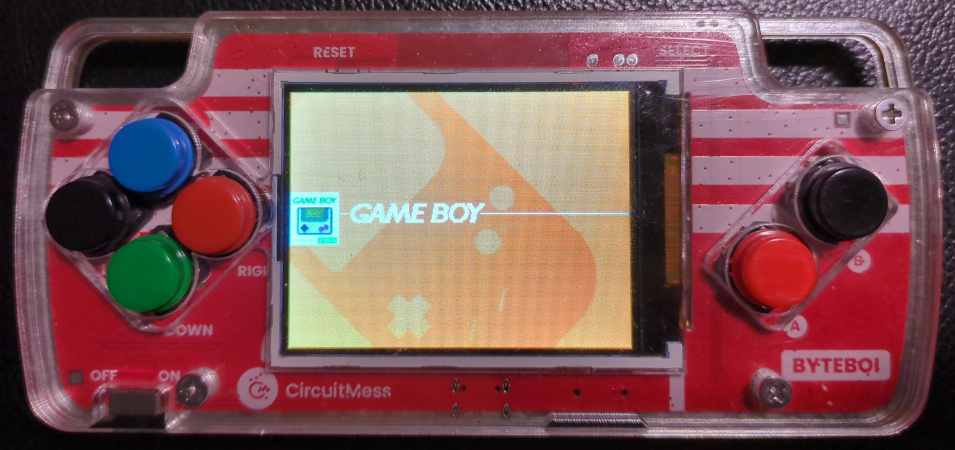

# CircuitMess Byteboi Rev. 1
- Status: completed
- Ref: https://circuitmess.com/products/byteboi-8-bit-game-console
- Ref: https://circuitmess.com/blogs/resources/byteboi-anatomy-guide-ch-1-pg-2

Button mapping:
- Start: Select + A
- Menu: Select + B
- Option: Select + Up

# Hardware info
- ESP-32-WROOM-32
- 4MB Flash
- 4MB LY68L6400 PSRAM
- RGB LEDs
- TC8002D amplifier
- PCA9539APW GPIO extender which connects the buttons and display backlight

# Known issues:
- Battery meter needs to be calibrated.
- No disk LED (yet). Theoretically, it should be possible to use the RGB-LED connected to the GPIO extender in the future.
- Only 4MB flash, so the full image does not fit and individual parts need to be selected. No OTA, no flashing of .fw file from SD-card.
- Really only supports the first hardware revision. The second revision has a different display and the buttons are connected differently, so it will definitely not work at all with this configuration!
- No display brightness support (the backlight is connected to the GPIO extender with no PWM support).
- Low sound quality due to use of internal 8-bit DAC (especially at low volumes).

# Images

