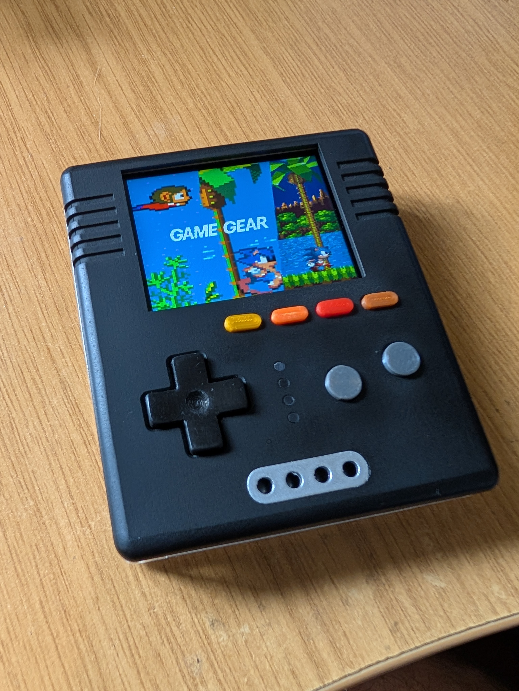

# CrokPocket by Megazoid (https://www.youtube.com/@megazoid)
- Status: Completed
- Ref: [Hackster link for guide, design files and gerbers](https://www.hackster.io/megazoid/crokpocket-a0ff83)

# Hardware info
- ESP32-S3 N16R8 (16MB flash + 8MB PSRAM)
- 2" 320x240 ST7789 display
- 600mAh 602550 battery
- USB-C charging port
- Status LED's for charging and RetroGo
- 3.5mm headphone jack

# Images

