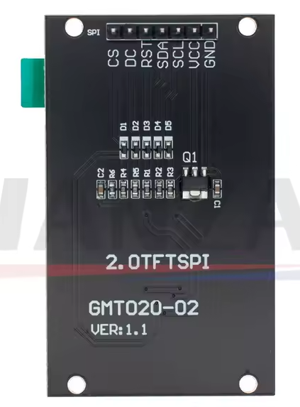
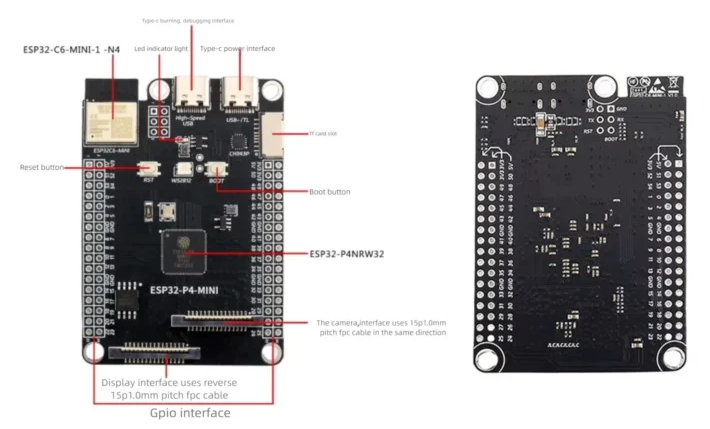

This is a very early "port" whose performance could be improved by adapting retro-go even further for the P4.

Networking has not been tested yet, so build the image without it:

command to build: `python rg_tool.py --target esp32-p4 build-img --no-networking`

ESP-IDF v5.5 is recommended.

## ESP32-P4
- Status: development target

## Hardware
- Module: ESP32-P4-MINI Development Board ref: https://www.cnx-software.com/2025/06/05/esp32-p4-mini-development-board-offers-two-34-pin-gpio-headers-esp32-c6-wireless-module
- ST7789V 320*240 2 inches SPI Display ref: LCD TFT 2.0 inches, IC ST7789V 240RGBx320, SPI
- SD card over SDMMC (4 bits)
- NS4168 Dac (but any I2S DAC should work)
- Built on breadboard

## Images

