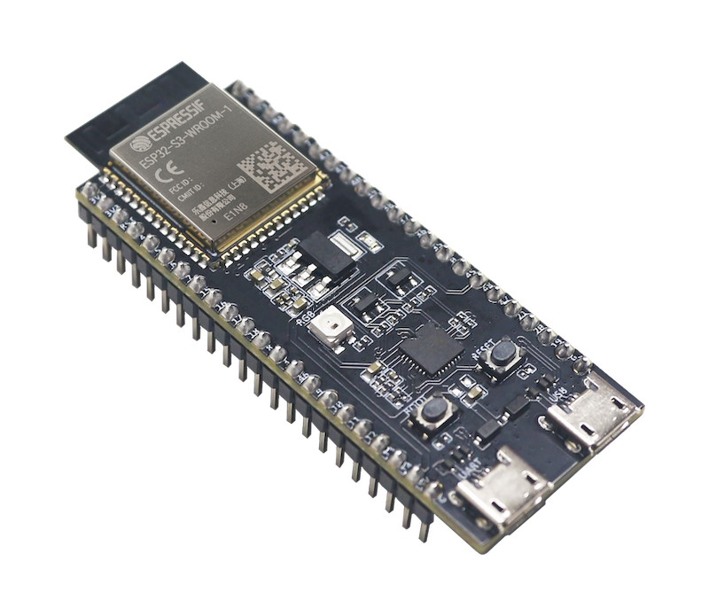

# ESP32-S3-DevKitC
- Status:
- Ref: https://docs.espressif.com/projects/esp-idf/en/v5.3.1/esp32s3/hw-reference/esp32s3/user-guide-devkitc-1.html

This target is intended as a reference point for an esp32-s3-based device.

**Make sure that your dev board has at least 4MB of PSRAM!**

# Hardware info
- ESP32-S3 dev board with PSRAM
- 320x240 SPI LCD using ILI9341 or ST7789
- External DAC
- SPI SD Card adapter
- UP/DOWN/LEFT/RIGHT are connected through a voltage divider
- SELECT/START/MENU/A/B are connected directly to GPIOs

# Known issues:

# Images

