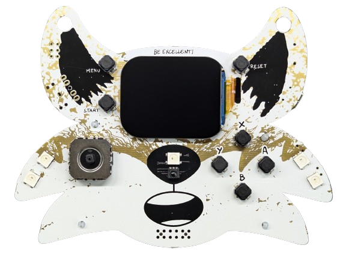

# Fri3D Camp 2024 Badge
- Status: completed
- Ref: https://github.com/Fri3dCamp/badge_2024_hw/
- Ref: https://fri3d.be/

This port developed for the Fri3D Camp 2024 Badge, based on the ESP32-S3 microcontroller.

# Hardware info

- Espressif ESP32-S3-WROOM-1-N16R8 (16MB flash + 8MB PSRAM)
- ST7789-based 2-inch IPS LCD with rounded corners
- joystick (X and Y axis)
- lots of game buttons
- microSD card reader
- 6-axis IMU by Würth Elektronik
- Piezoelectric Buzzer
- 5 multicolor LEDs (WS2812C)
- IR receiver
- Status LED
- battery charger
- battery (2000 mAh)
- USB-C connector
- Stemma QT connector
- Expansion Connector

# Images

