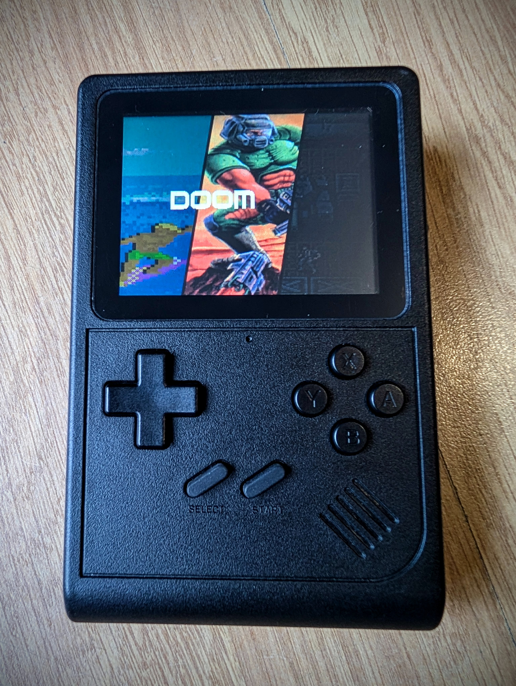
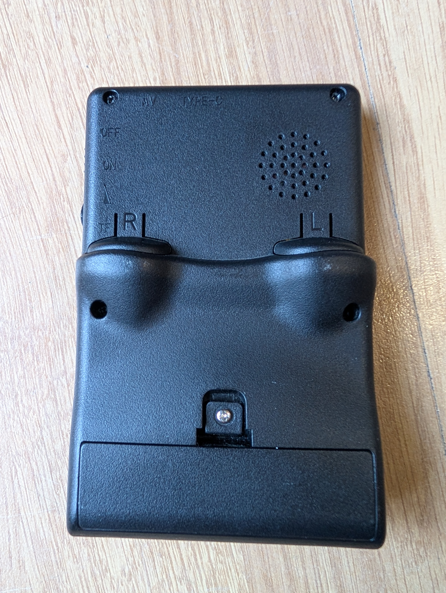

# GB300-P4
- Build Guide & BOM: [Instructables guide](https://www.instructables.com/GB300-P4-a-ESP32-P4-Based-Retro-Handheld-Using-the/)
- Status: Complete

Command to build (ESP-IDF v5.5): `python rg_tool.py --target gb300-p4 build-img --no-networking`

## Hardware
- Sup+/Datafrog GB300 - Uses its shell, buttons, membranes, speaker, 18650 battery etc
- Wireless-Tag ESP32-P4 WT0132P4-A1-N16R32
- ST7789V 320*240 2.8" SPI Display - STP0280A2-240320
- SD card over SDMMC (4 bits)
- NS4168 DAC
- TP4056 charge chip
- 2.5mm audio jack
- Volume wheel
- USB-C for charging and firmware updates

## Images

