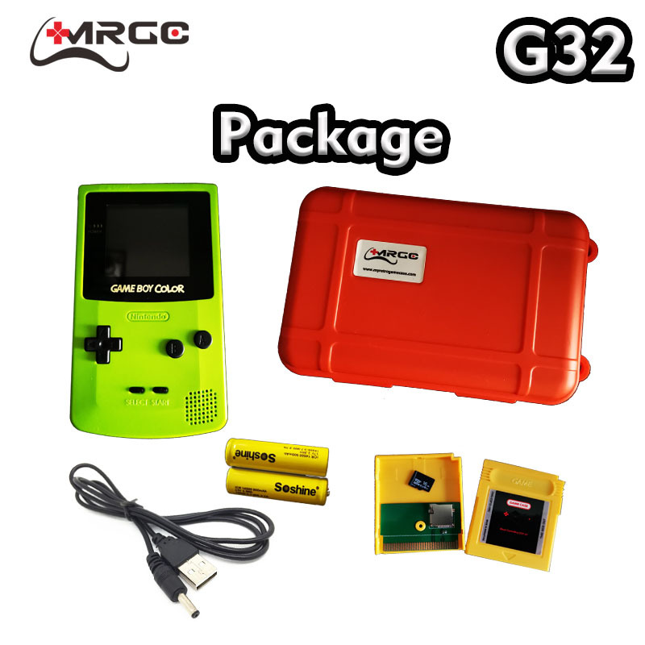

# MyRetroGameCase G32
- Status: Fully supported
- Ref: https://www.myretrogamecase.com/products/game-mini-g32-esp32-retro-gaming-console-1

**WARNING**: As of 2023 all links have been taking over by spam/scam!

# Hardware info
- ESP32-WROVER-B (SoC)
- STM32F071cbu7 (Apparently buttons, charging, LED, backlight?)
- NXP 1334A (I2S DAC)
- CS5082E (Power controller)
- P8302E (Amplifier)
- YT280S002 (ILI9341 LCD)

 * IO35 - MENU BTN
 * IO25 - I2S DAC
 * IO26 - I2S DAC
 * IO15 - SD CARD
 * IO2 - SD CARD
 * IO0 - SELECT BTN
 * IO4 - AMP EN
 * IO5 - LCD SPI CS
 * IO12 - LCD DC
 * IO18 - SPI CLK
 * IO23 - SPI MOSI
 * IO21 - STM32F (I2C)
 * IO22 - STM32F (I2C)
 *
 * IO27 - resistor then STM32?
 *
 * Power LED is connected to the STM32

# Images

