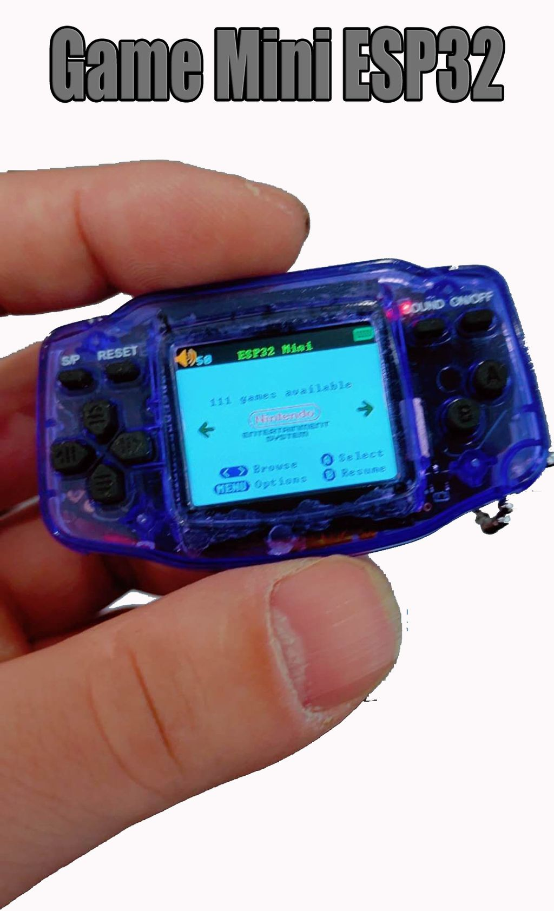

# MyRetroGameCase GBM
- Status:
- Ref: https://www.myretrogamecase.com/products/game-mini-esp32

**WARNING**: As of 2023 all links have been taking over by spam/scam!

Original firmware source code: GBA ESP32 link on https://www.myretrogamecase.com/pages/retro-handheld-gaming-firmware

// Source code is in the "esplay-base-firmware" directory of the .rar archive in the above link.

// Note: As of Late 2022, the owner of this shop has vanished from the net. Orders may not be fulfilled.

# Hardware info
- Unknown ESP-32 (Most likely ESP32-WROVER-B) (SOC)

# Known issues:
- Battery meter needs to be configured.
- Cropping most noticeable on NES, SNES, Genesis, PC Engine.
- Scaling option for above should eventually be removed or changed if downscaling is added.
- Disk LED does nothing (or isn't mapped yet) and should be removed for this target.
- Sometimes takes more than one attempt to flash. (Stock bootloader problem? Hardware?)
- Would benefit from a custom theme for small screens.

# Images

