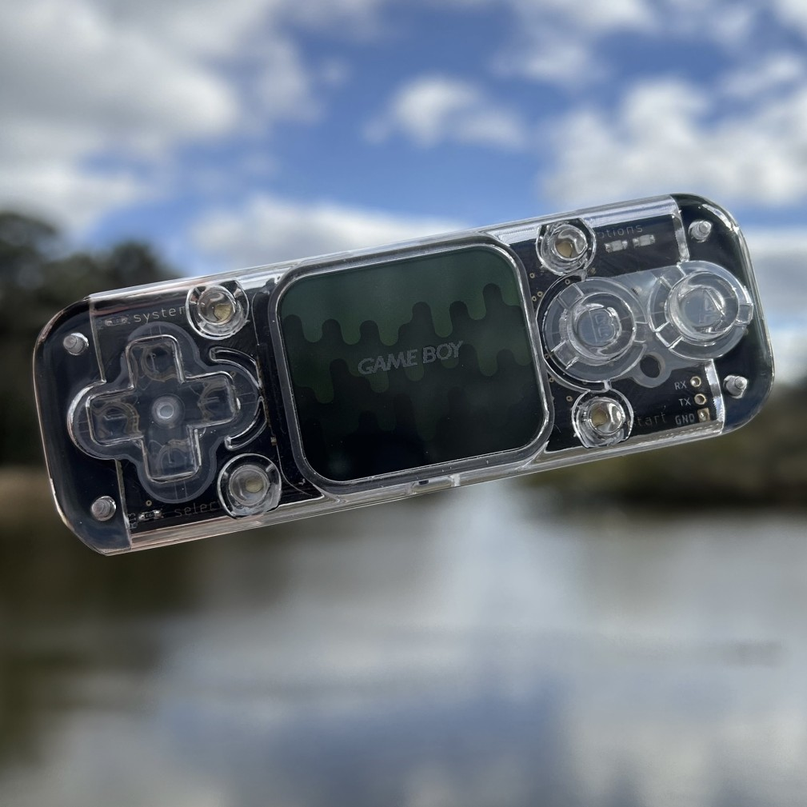

# Null Nano by Ampersand
- Status:
- Design files and BOM: https://github.com/DesignedbyAmpersand/Null-Nano

# Hardware info
- Module: ESP32-WROVER-E (16MB Flash)
- Screen: 1.69" ST7789V Screen with Rounded Corners
- Battery: 370mAh 502530 LiPo Battery

# Images

