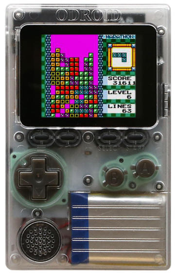

# ODROID-GO
- Status: Fully supported
- Ref: https://wiki.odroid.com/odroid_go/odroid_go

The original Retro-Go target!

# Hardware info
- Module: ESP32-WROVER-B
- Schematic: [schematic.pdf](schematic.pdf)

# Images

