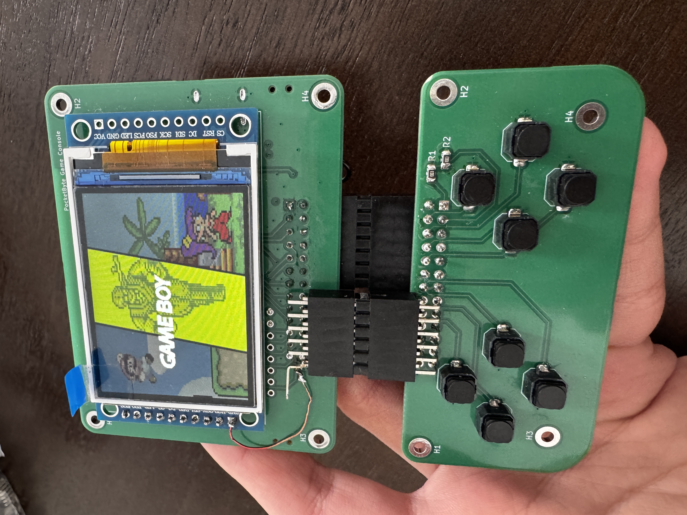

# PocketByte DevKit by POCKETBYTE TECHNOLOGY (https://pocketbyte.co)
- Status: Completed
- Ref: [PocketByte Developer Official Documentation](https://pocketbyte.co/docs)

# Hardware info
- ESP32-S3 N16R8 (16MB flash + 8MB PSRAM)
- 2" 320x240 ST7789 display
- Micro SD card slot
- MCP23017 I2C 8-button gamepad

See [PocketByte Developer | Hardware Specifications](https://pocketbyte.co/docs#hardware-specifications) for more details.

# Images

