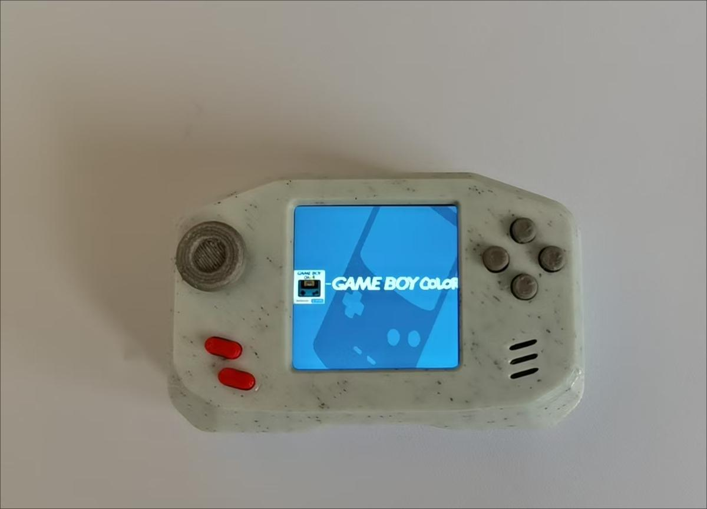

# RACHEL ESP32

- Status:
- Ref:

# Hardware info
- ESP32-S3R8 (SoC 8MB PSRAM)
- W25Q128JVPIQ (16MB FLASH )
- NS4168 (I2S DAC)
- st7789 (1.3 inch ips)
- TP4056 (Lipo Charger IC)
- battery (600mAh)

# Images

