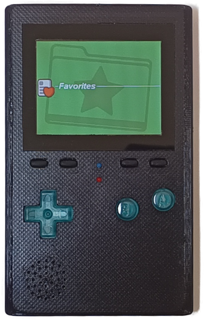

# REDROID-GO
- Status: Fully supported
- Ref: https://github.com/aseoista/redroid-go

DIY, open ODROID-GO clone, with improved features!

# Hardware info
- Module: ESP32-WROVER-E-N16R8
- USB-C Connector
- IPS Display
- CH340 serial converter
- GPIO
- 1200 mAh battery

# Images

