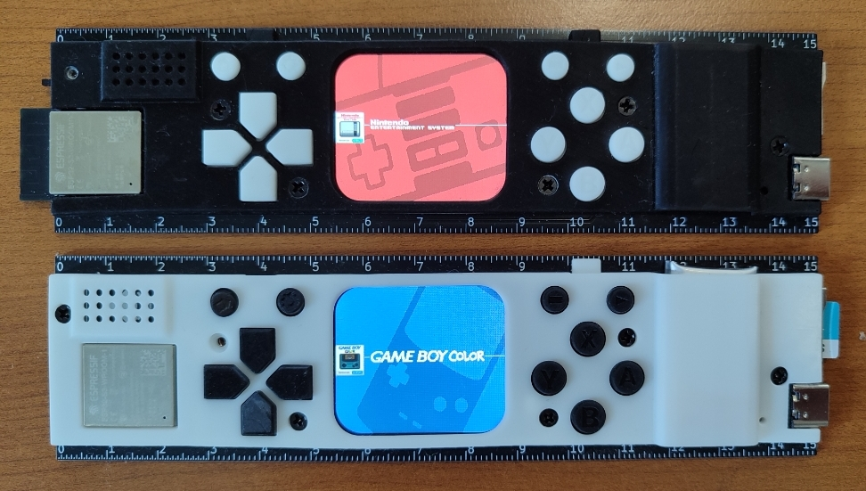

# RETRO-RULER
- Status: completed
- Ref: https://github.com/rapha-tech/Retro-Ruler

This port developed for the Retro-Ruler, based on the ESP32-S3 microcontroller.

# Hardware info

- Espressif ESP32-S3-WROOM-1-N16R8 (16MB flash + 8MB PSRAM)
- ST7789-based 1.69-inch IPS LCD with rounded corners
- microSD card reader
- 12 input buttons
- NS4168 DAC with 0.7W speaker
- battery charger
- battery (250 mAh)
- USB-C connector

# Images

