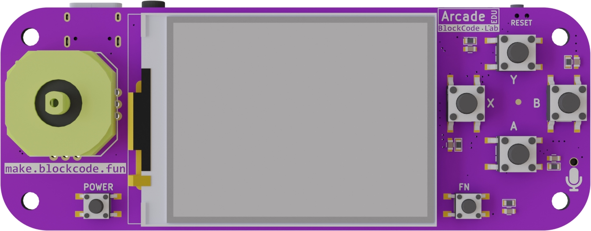

# Scratch Arcade (https://arcade.blockcode.fun/#/zh-cn/intro?id=scratch-arcade)
- Status: Completed

# Hardware info
- ESP32-S3 N8R8 (8MB flash + 8MB PSRAM)
- 2" 320x240 ST7789 display
- 800mAh battery
- USB-C charging port
- Status LED's for charging and RetroGo

# Images

# Build
`python rg_tool.py build-img --target scratch-arcade --fatsize 2M`
`mkdir -p rootfs/roms/nes`
`cp *.nes rootfs/roms/nes/`
`python $IDF_PATH/components/fatfs/fatfsgen.py --output_file vfs.bin  rootfs`

# Flash
`esptool.py write_flash --flash_size detect 0x0 retro-go_1.xx_scratch-arcade.img`
`esptool.py write_flash --flash_size detect 4587520 vfs.bin`

# Dev
`python rg_tool.py --target crokpocket --port COM9 run launcher`
