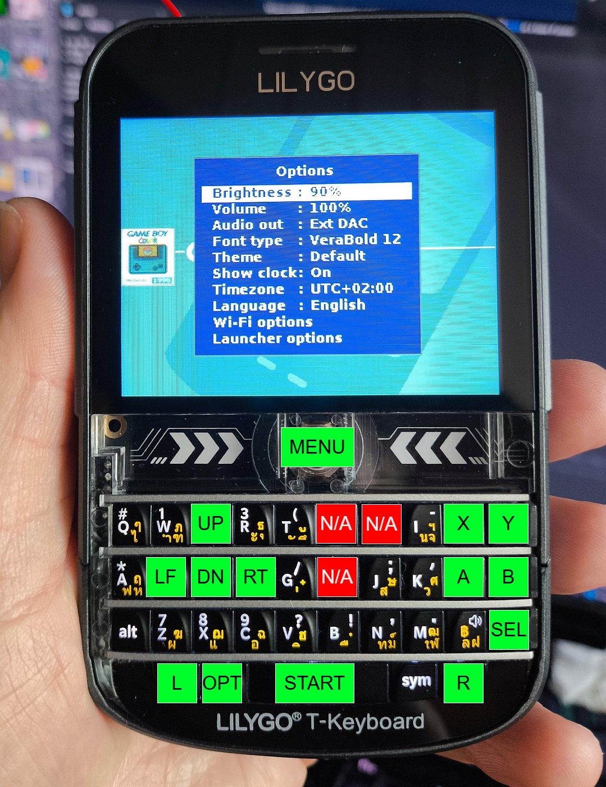

# Lilygo T-Deck Plus
- Status: Fully supported?
- Ref: https://github.com/Xinyuan-LilyGO/T-Deck 

Unfortunately the keyboard on this device as shipped can only provide the ASCII code of the last pressed key, no realtime status or press/release events. Fortunately it's driven by an ESP32-C3 that can be reprogrammed via a header on the board. 
A modified version that can be switched to providing the realtime state of each key is provided as `t-deck-plus_keyboard_raw_mode.bin` in this folder and can be flashed at 0x0, see the Ref link above for pinout information.  

The modified keyboard firmware has been PR'd to the original repo, source available here (https://github.com/Xinyuan-LilyGO/T-Deck/pull/87) 

See below image for the provided keyboard layout. It can be modified as desired in the target config, except for the 3 N/A keys (retro-go uses a 32bit value to store key states, but the keyboard has 35). 

# Hardware
- Module: ESP32-S3
- Display: 320x240
- Built-in battery
- I2S DAC

# Images

