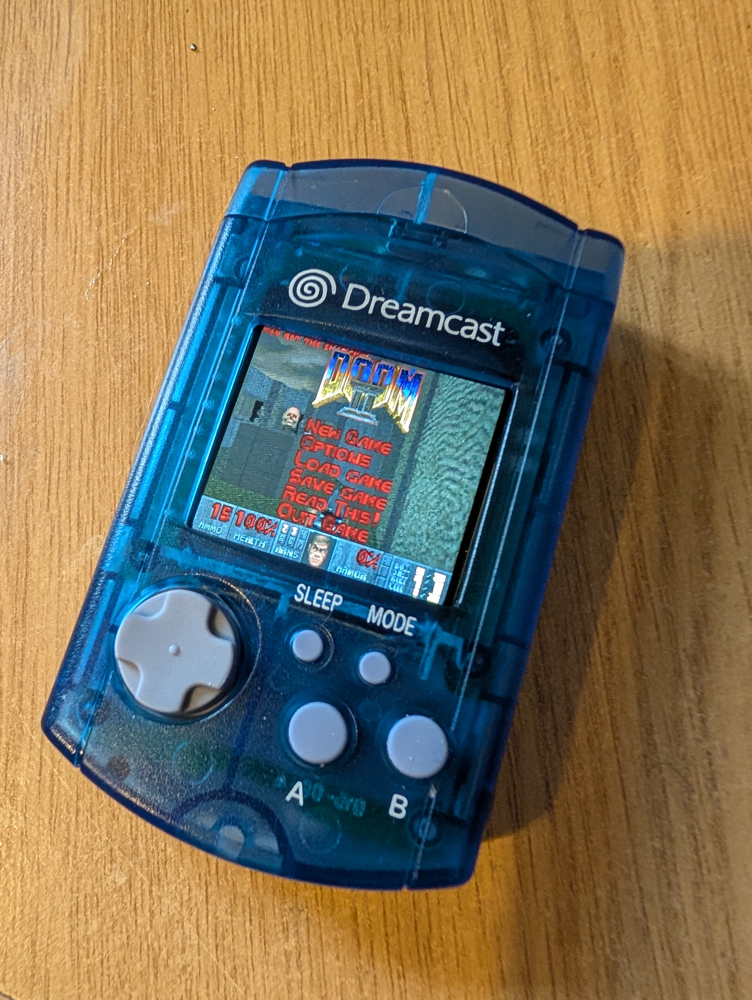

# VMU ESP32-S3
- Status: Complete
- Design files and BOM: [**Instructables link**](https://www.instructables.com/ESP32-VMU-Handheld-Console-Yes-It-Plays-Doom/)

# Hardware info
- Module: ESP32-S3 N16R8
- Screen: 1.69" ST7789V Screen
- 400mAh battery & charging via MicroUSB
- Improvements over V1: ESP32-S3 module, improved sound chip, onboard flashing, improved controls, status LED

# Images

