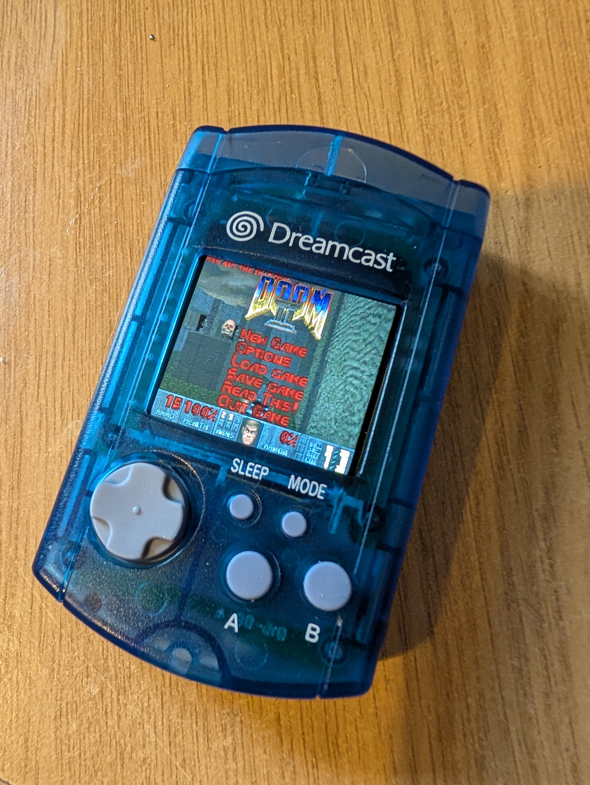

# VMU ESP32
- Status: Complete
- Design files and BOM: [**Instructables link**](https://www.instructables.com/ESP32-VMU-Handheld-Console-Yes-It-Plays-Doom/)

# Hardware info
- Module: ESP32-WROVER-E (16MB Flash)
- Screen: 1.69" ST7789V Screen
- 400mAh battery & charging via MicroUSB
- Sound
- Heavily based on Null Nano

# Images

