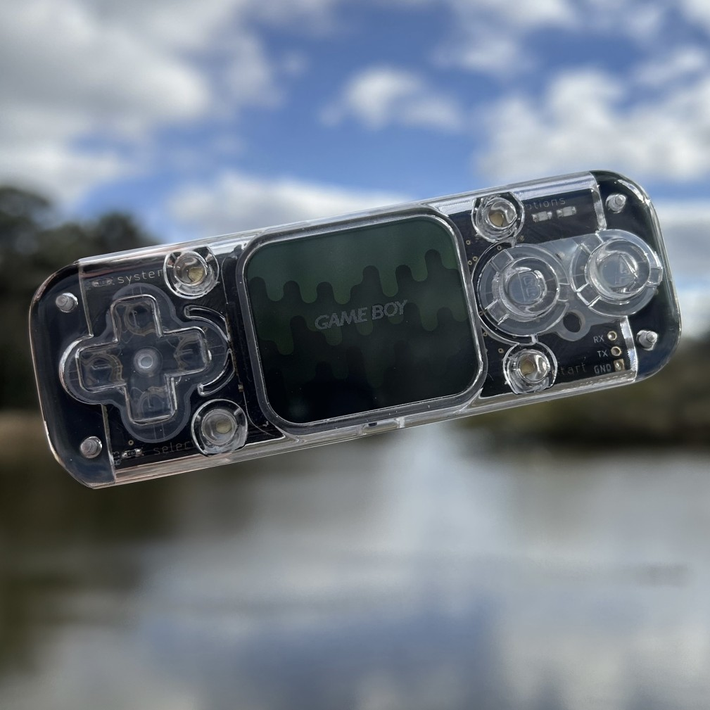

# Wrigley by Ampersand
- Status:
- Design files and BOM: https://1drv.ms/u/c/66cb300826c22fa3/EZojZfojVoZEkYMEGPpkHgABedPzleWljHVV_EgfXlDRwA?e=6xxioG

# Hardware info
- Module: ESP32-WROVER-E (16MB Flash)
- Screen: 1.69" ST7789V Screen with Rounded Corners
- Battery: 370mAh 502530 LiPo Battery

# Images

